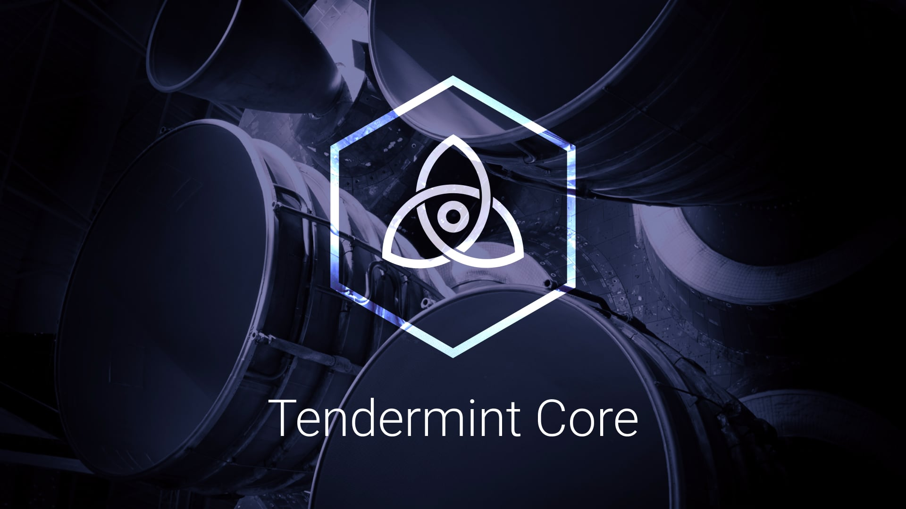

# Install Tendermint



## From Binary

To download pre-built binaries, see the [releases page](https://github.com/tendermint/tendermint/releases).

## Using Homebrew

You can also install the Tendermint binary by simply using homebrew,

```
brew install tendermint
```

## From Source

You'll need `go` [installed](https://golang.org/doc/install) and the required
environment variables set, which can be done with the following commands:

```sh
echo export GOPATH=\"\$HOME/go\" >> ~/.bash_profile
echo export PATH=\"\$PATH:\$GOPATH/bin\" >> ~/.bash_profile
```

Get the source code:

```sh
git clone https://github.com/tendermint/tendermint.git
cd tendermint
```

Then run:

```sh
make install
```

to put the binary in `$GOPATH/bin` or use:

```sh
make build
```

to put the binary in `./build`.

_DISCLAIMER_ The binary of Tendermint is build/installed without the DWARF
symbol table. If you would like to build/install Tendermint with the DWARF
symbol and debug information, remove `-s -w` from `BUILD_FLAGS` in the make
file.

The latest Tendermint is now installed. You can verify the installation by
running:

```sh
tendermint version
```

## Run

To start a one-node blockchain with a simple in-process application:

```sh
tendermint init validator
tendermint start --proxy-app=kvstore
```

## Reinstall

If you already have Tendermint installed, and you make updates, simply

```sh
make install
```

To upgrade, run

```sh
git pull origin master
make install
```

## Compile with CLevelDB support

Install [LevelDB](https://github.com/google/leveldb) (minimum version is 1.7).

Install LevelDB with snappy (optionally). Below are commands for Ubuntu:

```sh
sudo apt-get update
sudo apt install build-essential

sudo apt-get install libsnappy-dev

wget https://github.com/google/leveldb/archive/v1.20.tar.gz && \
  tar -zxvf v1.20.tar.gz && \
  cd leveldb-1.20/ && \
  make && \
  sudo cp -r out-static/lib* out-shared/lib* /usr/local/lib/ && \
  cd include/ && \
  sudo cp -r leveldb /usr/local/include/ && \
  sudo ldconfig && \
  rm -f v1.20.tar.gz
```

Set a database backend to `cleveldb`:

```toml
# config/config.toml
db_backend = "cleveldb"
```

To install Tendermint, run:

```sh
CGO_LDFLAGS="-lsnappy" make install TENDERMINT_BUILD_OPTIONS=cleveldb
```

or run:

```sh
CGO_LDFLAGS="-lsnappy" make build TENDERMINT_BUILD_OPTIONS=cleveldb
```

which puts the binary in `./build`.